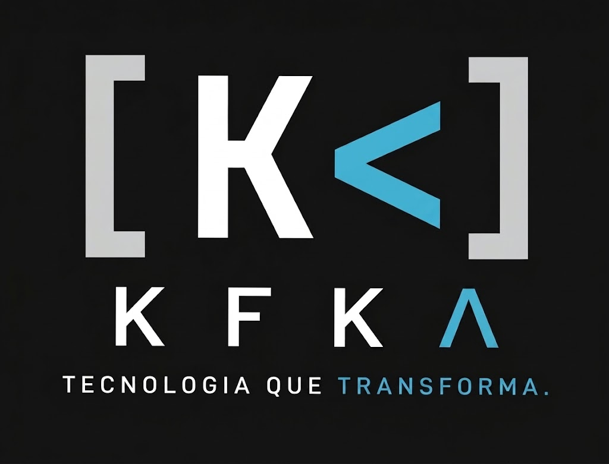

# FECAP - Fundação de Comércio Álvares Penteado

<p align="center">
<a href= "https://www.fecap.br/"></a>
</p>

# KFKA – Plataforma de Acompanhamento Escolar

<p align="center">
  
</p>

## AlphaTech

## Integrantes: <a href="https://www.linkedin.com/in/igor-ara%C3%BAjo-b1719129b/"> Igor Araujo</a>, <a href="https://www.linkedin.com/in/matheus-l-19385b298">Matheus Teixeira</a>, <a href="https://www.linkedin.com/in/daniel-c%C3%A2mara-freitas-796772393/">Daniel Camara</a>, <a href="https://www.linkedin.com/in/enzo-lemos-5333963ab/">Enzo Lemos</a>

## Professores Orientadores:  <a href="https://www.linkedin.com/in/adriano-valente/">Adriano Felix Valente</a>, <a href="https://www.linkedin.com/in/eduardo-savino/">Eduardo Savino Gomes</a>, <a href="https://www.linkedin.com/in/francisco-escobar/">Francisco Escobar</a>, <a href="https://www.linkedin.com/in/jbuesso/">José Carlos Buesso Junior</a>, <a href="https://www.linkedin.com/in/ronaldo-araujo-pinto-3542811a/">Ronaldo Araujo Pinto</a>,


## Descrição

A KFKA – Plataforma de Acompanhamento Escolar é uma aplicação web responsiva desenvolvida para auxiliar escolas de Ensino Fundamental no acompanhamento acadêmico dos alunos e na comunicação entre professores, administradores e pais ou responsáveis.

A plataforma permite que os professores registrem o acompanhamento bimestral dos alunos, incluindo informações como descrição, média e tags. Os registros podem ser salvos como rascunho e enviados para revisão do administrador, que poderá revisar, alterar, devolver para ajustes ou publicar as informações. Após a publicação, os pais ou responsáveis podem consultar os relatórios dos alunos aos quais estão vinculados e gerar os documentos em PDF.

## 🛠 Estrutura de pastas

```text
Projeto38/
├── documentos/
│   ├── entrega 1/
│   │   └── disciplinas/
│   └── entrega 2/
│       └── disciplinas/
│
├── imagens/
│   └── imagens do projeto
│
├── src/
│   ├── entrega 1/
│   │   ├── frontend/
│   │   └── backend/
│   │
│   └── entrega 2/
│       ├── frontend/
│       └── backend/
│
└── README.md
```

## 💻 Configuração para Desenvolvimento

Para desenvolver o projeto KFKA, é necessário utilizar as ferramentas e tecnologias definidas pela equipe durante o desenvolvimento.

As instruções de instalação das dependências e execução do projeto serão adicionadas conforme a implementação do sistema.


## 🎓 Referências

As seguintes fontes foram utilizadas como referência para o desenvolvimento do projeto:

1. [FECAP – Fundação de Comércio Álvares Penteado](https://www.fecap.br/)
2. [KFKA Tech](https://kfkatech.com/)
3. Materiais e conteúdos disponibilizados nas aulas da FECAP.
